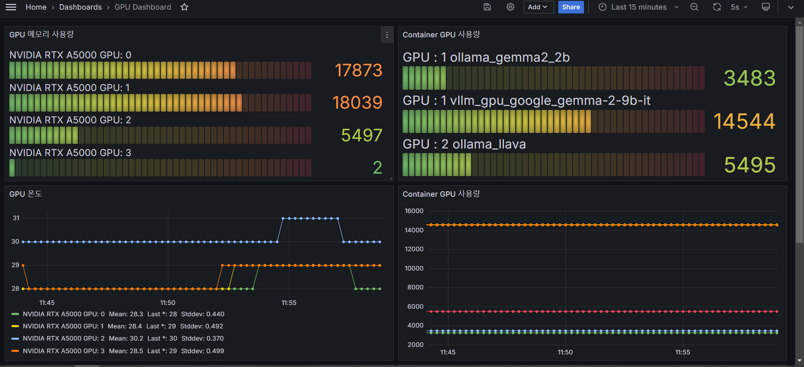

# ContainerMonitoring README

## 개요
ContainerMonitoring은 GPU PID 모니터링을 위한 도구로, Docker 컨테이너 내에서 GPU 사용량을 추적하고 기록합니다. 이 프로젝트는 NVIDIA GPU를 사용하는 애플리케이션의 성능을 모니터링하고, GPU 메모리 사용량 및 프로세스 정보를 수집하는 데 도움을 줍니다.

## 설치 가이드

### 요구 사항
- Docker
- NVIDIA 드라이버
- NVIDIA Container Toolkit

### 설치 단계

1. **Docker 설치**
   - Docker가 설치되어 있지 않은 경우, [Docker 공식 문서](https://docs.docker.com/get-docker/)를 참조하여 설치합니다.

2. **NVIDIA 드라이버 설치**
   - GPU에 맞는 NVIDIA 드라이버를 설치합니다. [NVIDIA 드라이버 다운로드 페이지](https://www.nvidia.com/Download/index.aspx)에서 드라이버를 다운로드할 수 있습니다.

3. **NVIDIA Container Toolkit 설치**
   - NVIDIA Container Toolkit을 설치하여 Docker에서 GPU를 사용할 수 있도록 설정합니다. 다음 명령어를 사용하여 설치합니다:
     ```bash
     sudo apt-get install -y nvidia-docker2
     sudo systemctl restart docker
     ```

4. **프로젝트 클론**
   - Git을 사용하여 프로젝트를 클론합니다:
     ```bash
     git clone https://github.com/sungreong/gpu-monitoring-in-containers.git
     cd gpu-monitoring-in-containers
     ```

5. **Docker Compose 실행**
   - Docker Compose를 사용하여 서비스를 시작합니다:
     ```bash
     docker-compose up -d
     ```

## 사용 방법

- GPU PID 모니터링은 `gpu_monitor.py` 스크립트를 통해 수행됩니다. 이 스크립트는 주기적으로 GPU 사용량을 기록하고, 로그 파일에 저장합니다.
- 로그 파일은 `gpu-pid-monitor/data/gpu_monitor.log`에 위치하며, GPU 사용량 및 프로세스 정보를 포함합니다.

## 로그 파일 설명

로그 파일은 다음과 같은 형식으로 기록됩니다:

```
2024-09-18 00:37:23,284 - INFO - Active: Container=ollama_gemma2_2b, GPU Index=1, GPU Name=NVIDIA RTX A5000, Used Memory=3483 MB
```

- **Container**: 컨테이너 이름
- **GPU Index**: 사용 중인 GPU의 인덱스
- **GPU Name**: GPU의 이름
- **Used Memory**: 사용 중인 메모리 양


## 문제 해결

- **컨테이너가 실행되지 않음**: `docker-compose logs` 명령어를 사용하여 로그를 확인하고, 오류 메시지를 분석합니다.
- **GPU 정보가 표시되지 않음**: NVIDIA 드라이버와 Container Toolkit이 올바르게 설치되었는지 확인합니다.

## 기여

이 프로젝트에 기여하고 싶으신 분은 Pull Request를 통해 기여해 주시기 바랍니다. 이슈가 발생한 경우, GitHub의 이슈 트래커를 통해 보고해 주세요.

## 라이센스

이 프로젝트는 MIT 라이센스 하에 배포됩니다.

## 이미지

<div style="text-align: center;">
    
</div>